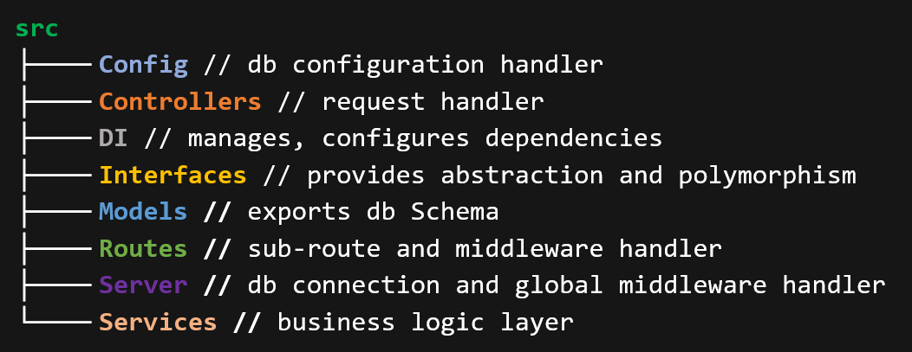
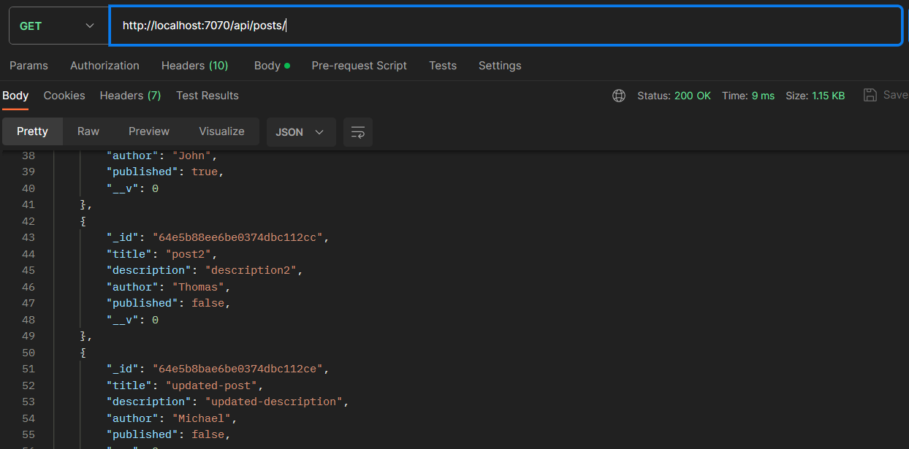
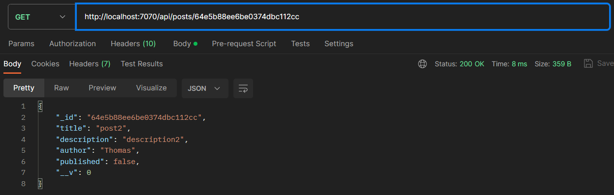
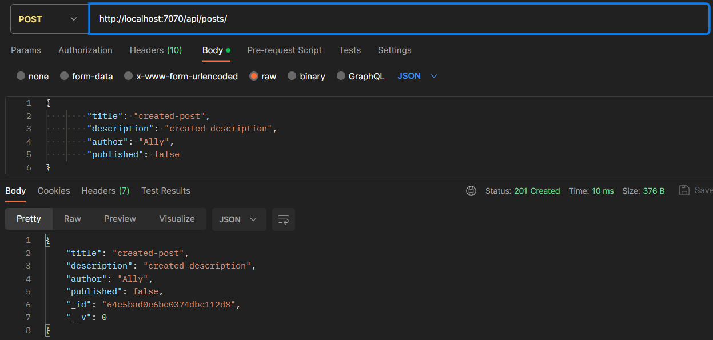
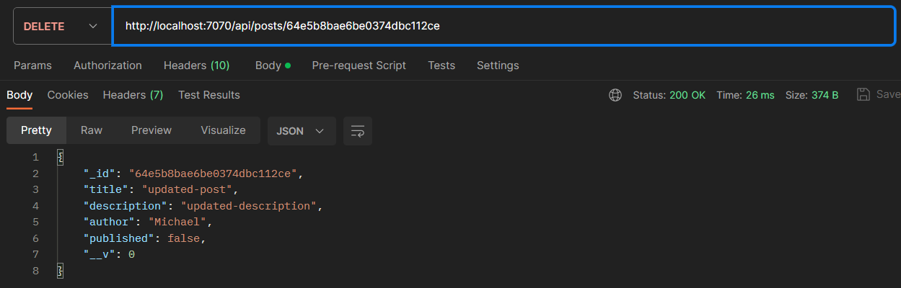

### CRUD Application Using  Typescript, Node.js, Express, MongoDB and Inversify.


### Table of Contents

- [Dependency](#dependency)
- [Features](#features)
- [Architecture](#architecture)
- [Installation](#installation)
- [Test](#test)

### Dependency

- **Typescript**: TypeScript is a superset of JavaScript that adds static typing to the language. It compiles to JavaScript and can be used both in browser environments and in server-side environments like Node.js. Typesript also support generic class, type annotation, interface, enums, union type, private-protected memmber while JavaScript doesn't support.

- **Node.js:** Node.js is a runtime environment that enables you to run JavaScript code on the server side.

- **Express:** Express is a web application framework for Node.js that simplifies building APIs and web applications by providing a set of tools and utilities. It's like SpringBoot in Java, Django in Phyton, .Net for C#.

- **MongoDB:** MongoDB is a NoSQL database system designed for storing and managing unstructured or semi-structured data.

- **Mongoose:** Mongoose is an ODM library for MongoDB and Node.js. It simplifies interacting with MongoDB by providing a structured way to define schemas, models, and additional functionality.

- **Inversify:** It deals with how components or classes obtain their dependencies without creating them directly. Instead of creating dependencies within a class, dependencies are "injected" from the outside.

### Features

- _Establishing a MongoDB connection and transactions with mongoose,_
- _Route handling mechanism using Express.js framework,_
- _Interface, enum, type alias, static typing, access modifiers usage,_
- _Dependency injection using Inversify,_
- _Using Repository-MVC pattern_


### Architecture



### Installation

```bash
# Example installation commands
git clone https://github.com/ahmetozydn/typescript-crud.git
cd yourproject
npm install
# After making your own MongoDB connection
npm start
```

### Test

- `postman` is used to test endpoints.

_get all posts_

_get a post_

_create a post_

_update post_

_delete post_
