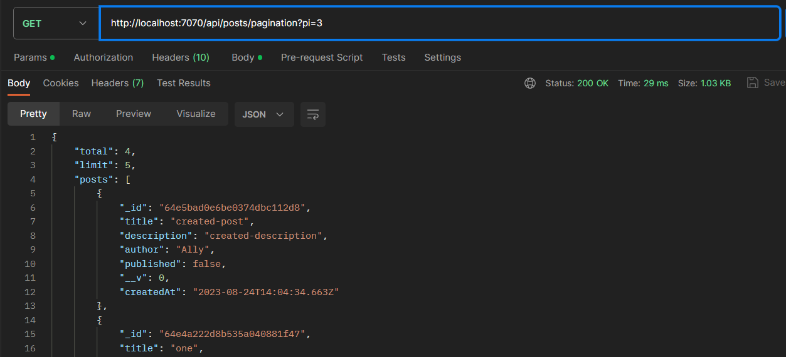

### CRUD Application Using  Typescript, Node.js, Express, MongoDB and Inversify.


### Table of Contents

- [Dependency](#dependency)
- [Features](#features)
- [Architecture](#architecture)
- [Installation](#installation)
- [Test](#test)

### Dependency

- **Typescript**: TypeScript is a superset of JavaScript that adds static typing to the language. It compiles to JavaScript and can be used both in browser environments and in server-side environments like Node.js. Typesript also support generic class, type annotation, interface, enums, union type, private-protected memmber while JavaScript doesn't support.

- **Node.js:** Node.js is a runtime environment that enables you to run JavaScript code on the server side.

- **Express:** Express is a web application framework for Node.js that simplifies building APIs and web applications by providing a set of tools and utilities. It's like SpringBoot in Java, Django in Phyton, .Net for C#.

- **MongoDB:** MongoDB is a NoSQL database system designed for storing and managing unstructured or semi-structured data.

- **Mongoose:** Mongoose is an ODM library for MongoDB and Node.js. It simplifies interacting with MongoDB by providing a structured way to define schemas, models, and additional functionality.

- **Inversify:** It deals with how components or classes obtain their dependencies without creating them directly. Instead of creating dependencies within a class, dependencies are "injected" from the outside.

### Features

- [x] _Establishing a MongoDB connection and transactions with mongoose ODM,_
- [x] _Route handling mechanism using Express.js framework,_
- [x] _Interface, enum, type alias, static typing, access modifiers, default parametre usage,_
- [x] _Dependency injection using Inversify,_
- [x] _Using Repository-MVC pattern,_
- [x] _Exact string match search like `?search=text%20most`,_
- [x] _Data filtering like `?filter=likes:2-10`,_
- [x] _Pagination `?pi=2`,_
- [x] _Sorting for fields `?sort=likes&orderby=asc` | `?sort=title&orderby=desc` | `sort=author&orderby=desc`,_
- [x] _Query combination-query pool;_

`?sort=description&pi=3`
`?sort=title&orderby=desc&pi=2`
`?q=find%20me&sort=author&orderby=asc&pi=2`
`?sort=likes&orderby=asc&filter=likes:3-24&pi=2`
`?sort=description&orderby=descpription&filter=likes:3-10&pi=1`

### Architecture


### Installation

```bash
git clone https://github.com/ahmetozydn/typescript-crud.git
cd yourproject
npm install
# After establishing your MongoDB connection!
npm start
```

### Test

- `postman` is used to test endpoints.

- Query Combination;

_pagination_


- CRUD operations;

|get a post|delete a post|
|---|---|
|||

|get all posts|create a post|
|---|---|
|||


### Further topics

- [ ] Architecture improvement
- [ ] Generating dynamic di for pagination class,
- [ ] Custom error handler mechanism,
- [ ] Authentication, authorization,
- [ ] Partial searching method for MongoDB because it doesn't provide efficient way
- [ ] Rate limiting, caching
- [ ] Handling file uploads through API endpoints.
- [ ] Understanding CORS and configuring it for your API.
- [ ] Support for multiple languages and locales.
